# STATUS

**Phase:** 0 — Foundations
**Last validated:** 2026-05-12 — B0, B1, and B2.5 all complete (5 tasks total, two-stage review)
**Next:** B2 (Task 2.2 ADR-0002 stack-lock — blocked on user-side MT5 spike result), then W1 (Tasks 3.1 + 3.2 + 4.1)

## Session log

- **2026-05-12 #1** — DAG approved. B0 dispatched (parallel agents for 1.1 and 1.3). Both impl agents passed self-review. Two fresh reviewer agents returned APPROVED WITH FOLLOW-UPS. Real bugs caught: (a) `.gitignore` had broken `~/...` pattern that git does not expand; (b) `spike_mt5.py` leaked MT5 session on failure paths. Both fixed. Commits: `e041372`, `1397dd7`, `1af89a6`.

- **2026-05-12 #2** — B1 (Task 1.2 + Task 2.1) and B2.5 (synthetic returns fixture) dispatched in parallel. Three impl agents reported. Three fresh reviewers ran in parallel. **One CRITICAL bug caught by Task 1.2's reviewer:** pre-push pytest hook used `language: python` with an isolated venv that couldn't see project deps — every `git push` after the first real test landed would have been blocked. Fixed by switching to `language: system`. **One IMPORTANT issue caught by B2.5's reviewer:** seed `20260512` sat at the lower tail of the expected t distribution, forcing the trending t-test to relax to p<0.05. Bumped seed to `20260514` (realized t=3.77), restored strict p<0.01 threshold. ADR-0001 reviewer caught 5-of-5 scope-creep stress tests already blocked; 8 minor follow-ups applied. Commits: `c2f777b`, `6e658e0`, `e72bf52`, `9c49812`, `72a79bc`.

### Between-wave drift check — B1+B2.5 → W1

After B1+B2.5 merged, upstream impact on subsequent waves: **none**. The pre-commit hook fix is forward-compatible (any W1+ agent benefits from the working pre-push gate). The B2.5 fixture's new SHA256 (`f937ab719140...`) is now the canonical hash that W5 agents will pin. The mypy `additional_dependencies` now includes `pyarrow` and `numpy`, which is forward-compatible. ADR-0001 wording changes do not invalidate any prior task. **Cleared to dispatch W1 once user signals.**

---

## Phase 0 Task DAG

Nodes = tasks from `docs/superpowers/plans/2026-05-12-phase-0-foundations.md`.
Edges = "must complete before."
Color = parallelizable group / sequential anchor / acceptance gate.

```mermaid
flowchart TD
    %% ============ Layer 0: foundation ============
    T1_1["1.1 pyproject scaffold<br/>(git init, deps, tooling)"]:::anchor
    T1_3["1.3 MT5 risk spike<br/>(Windows VPS, 0.01 lot demo)"]:::anchor

    %% ============ Layer 1: tooling + ADRs ============
    T1_2["1.2 pre-commit gate<br/>(ruff/mypy/pytest)"]:::anchor
    T2_1["2.1 ADR-0001 goals"]:::parallel
    T2_2["2.2 ADR-0002 stack-lock"]:::anchor

    T1_1 --> T1_2
    T1_1 --> T2_1
    T1_3 --> T2_2
    T1_1 --> T2_2

    %% ============ Layer 2: massively parallel after 1.2 ============
    T3_1["3.1 Dukascopy DL"]:::parallel
    T3_2["3.2 HistData DL"]:::parallel
    T4_1["4.1 Snapshot writer<br/>(content-hashed)"]:::parallel
    T5_1["5.1 Holiday/DST module"]:::parallel
    T5_4["5.4 Lookahead linter (AST)"]:::parallel
    T6_2["6.2 Commission tables"]:::parallel
    T6_3["6.3 Swap/financing"]:::parallel
    T8_1["8.1 CPCV harness"]:::parallel
    T8_2["8.2 Walk-forward"]:::parallel
    T9_1["9.1 DSR"]:::parallel
    T9_2["9.2 PBO"]:::parallel
    T10_1["10.1 MC block bootstrap"]:::parallel
    T11_1["11.1 FTMO predicates"]:::parallel
    T11_2["11.2 FundedNext+FundingPips preds"]:::parallel

    T1_2 --> T3_1
    T1_2 --> T3_2
    T1_2 --> T4_1
    T1_2 --> T5_1
    T1_2 --> T5_4
    T1_2 --> T6_2
    T1_2 --> T6_3
    T1_2 --> T8_1
    T1_2 --> T8_2
    T1_2 --> T9_1
    T1_2 --> T9_2
    T1_2 --> T10_1
    T1_2 --> T11_1
    T1_2 --> T11_2

    %% ============ Layer 3 ============
    T3_3["3.3 Background fetch<br/>(80GB Dukascopy)"]:::anchor
    T5_2["5.2 Gap report"]:::parallel
    T12_1["12.1 Challenge state machine"]:::parallel
    T14_1["14.1 ADR-0003 bridge choice"]:::anchor

    T3_1 --> T3_3
    T3_2 --> T3_3
    T4_1 --> T5_2
    T11_1 --> T12_1
    T11_2 --> T12_1
    T2_2 --> T14_1
    T1_3 --> T14_1

    %% ============ Layer 4 ============
    T4_2["4.2 Ingest raw → snapshot<br/>(critical anchor)"]:::anchor
    T14_2["14.2 Bridge adapter (MT5Client)"]:::anchor

    T3_3 --> T4_2
    T4_1 --> T4_2
    T14_1 --> T14_2

    %% ============ Layer 5: simulator calibration ============
    T5_3["5.3 Vendor reconciliation"]:::parallel
    T6_1["6.1 Spread model (empirical)"]:::parallel
    T7_1["7.1 Slippage model (empirical)"]:::parallel

    T4_2 --> T5_3
    T4_2 --> T6_1
    T4_2 --> T7_1

    %% ============ Layer 6: fill engine compose ============
    T7_2["7.2 Fill engine<br/>(unified simulator)"]:::anchor

    T6_1 --> T7_2
    T6_2 --> T7_2
    T6_3 --> T7_2
    T7_1 --> T7_2

    %% ============ Layer 7: gates + downstream consumers ============
    T10_2["10.2 Stress replay"]:::sequential
    T13_1["13.1 ACCEPTANCE GATE 1<br/>Placebo (alpha leak detector)"]:::gate
    T14_3["14.3 ACCEPTANCE GATE 2<br/>MT5 hello-world + sim/live compare"]:::gate

    T4_2 --> T10_2
    T7_2 --> T10_2
    T7_2 --> T13_1
    T4_2 --> T13_1
    T14_2 --> T14_3
    T7_2 --> T14_3

    %% ============ Layer 8: gate review ============
    T15_1["15.1 PHASE 0 GATE REVIEW<br/>(blocks Phase 1)"]:::gate

    T13_1 --> T15_1
    T14_3 --> T15_1
    T5_2 --> T15_1
    T5_3 --> T15_1
    T5_4 --> T15_1
    T5_1 --> T15_1
    T8_1 --> T15_1
    T8_2 --> T15_1
    T9_1 --> T15_1
    T9_2 --> T15_1
    T10_1 --> T15_1
    T10_2 --> T15_1
    T12_1 --> T15_1
    T2_1 --> T15_1

    classDef parallel fill:#1b5e20,stroke:#4caf50,color:#fff
    classDef sequential fill:#1a237e,stroke:#5c6bc0,color:#fff
    classDef anchor fill:#b71c1c,stroke:#ef5350,color:#fff
    classDef gate fill:#e65100,stroke:#ffb300,color:#000
```

**Legend:**
- 🟥 **Anchor** (red): critical-path sequential. Blocks downstream layers.
- 🟦 **Sequential** (blue): not on critical path but has upstream deps.
- 🟩 **Parallel** (green): independent within layer; dispatch as a parallel batch.
- 🟧 **Gate** (orange): acceptance gate; failure stops Phase 0.

---

## Critical path

`1.1 → 1.2 → 3.1 → 3.3 → 4.2 → 6.1 → 7.2 → 13.1 → 15.1`
Parallel branch: `1.3 → 14.1 → 14.2 → 14.3 → 15.1`

Both branches converge at 15.1. Wall-clock is bounded by **max(data branch, MT5 branch) + gate review**. With parallelization the 15-day plan compresses to roughly 8–10 wall-clock days, dependent on Dukascopy fetch latency (3.3) and the Windows VPS being provisioned in time.

---

## Parallel dispatch batches (planned)

| Batch | When | Tasks | Notes |
|---|---|---|---|
| **B0** | ✅ done 2026-05-12 | 1.1, 1.3 | Repo init + MT5 spike package (script + runbook + ZMQ fallback). User-side: VPS provisioning still pending |
| **B1** | ✅ done 2026-05-12 | 1.2, 2.1 | Pre-commit gate (CRITICAL pre-push fix applied) + ADR-0001 goals |
| **B2** | after spike result | 2.2 | Stack-lock ADR (gated on user running the spike) |
| **B2.5** | ✅ done 2026-05-12 | synthetic returns fixture | Canonical fixture sha256=`f937ab719140...` — pins regenerated with seed 20260514 |
| **B3a** | after B2.5 | 8.1, 8.2, 9.1, 9.2, 10.1 | Validation math (CPCV/walkforward/DSR/PBO/MC). All consume the fixture |
| **B3b** | after B1 (parallel with B2.5) | 3.1, 3.2, 4.1, 5.1, 5.4, 6.2, 6.3, 11.1, 11.2 | Data DLs + snapshot + quality + linter + cost components + rules predicates |
| **B4** | after 3.1+3.2 | 3.3 | Background fetch (long-running, single agent) |
| **B5** | after 4.1 | 5.2 | Gap report (needs snapshot iface, not real data) |
| **B6** | after 11.1+11.2 | 12.1 | State machine |
| **B7** | after 2.2+1.3 | 14.1 | ADR-0003 |
| **B8** | after 3.3+4.1 | 4.2 | Ingest (single critical-path agent) |
| **B9** | after 4.2 | 5.3, 6.1, 7.1 | Empirical sim calibration |
| **B10** | after 6.1+6.2+6.3+7.1 | 7.2 | Fill engine |
| **B11** | after 14.1 | 14.2 | Bridge adapter |
| **B12** | after 7.2+4.2 | 10.2, **13.1 (Gate 1)** | Stress replay + placebo gate |
| **B13** | after 14.2+7.2 | **14.3 (Gate 2)** | MT5 hello-world + sim/live compare |
| **B14** | after 13.1+14.3 + everything | **15.1 Phase 0 gate review** | Final |

B3 has been split into B3a (validation math, 5 tasks, blocked by B2.5 fixture) and B3b (everything else, 9 tasks, parallel-friendly). B2.5 was added per user constraint: all validation-math agents must consume the same canonical synthetic-returns fixture. Reviewer flags any B3a agent that generates its own.

---

## Per-task review protocol (every batch)

1. Implementation agent (fresh) executes the task per the plan.
2. Implementation agent runs its own self-review (announce `superpowers:requesting-code-review` and report findings).
3. Second fresh reviewer agent reviews from the opposite perspective.
4. Task only marked completed when **both** pass.
5. If either flags issues, fixes are applied (by main session for small integration glue, or a fresh fixer agent for substantive changes); loop until both clean.

Acceptance gates (13.1, 14.3, 15.1) get an additional `superpowers:verification-before-completion` invocation with command output pasted into STATUS.md before the "PASSED" claim.

## Between-wave protocol (B3 sub-batches W1→W5)

After each wave's commits land:
1. Post a one-line drift note to STATUS.md: **"Wave Wn merged — upstream impact: none / <specific change>"**.
2. If drift detected (e.g., W1's snapshot manifest schema differs from what W3/W4/W5 will need): pause, fold the change back through the plan, then dispatch the next wave.
3. Cheap insurance — catches schema drift before 5 downstream agents are working from a stale assumption.

## W4 sequencing (rules-as-code) — NOT parallel within wave

W4 has two tasks that look independent but share a base class:
1. **W4a: Task 11.1 (Predicate ABC + FTMO predicates)** — dispatch first, alone. Defines `Predicate` base class, FTMO predicates inherit it.
2. **W4b: Task 11.2 (FundedNext + FundingPips predicates)** — dispatch ONLY after 11.1's commit lands. 11.2 inherits the same ABC.

Reviewer rejects 11.2 if it (a) redefines or shadows the ABC, (b) diverges from FTMO's predicate pattern without justification, or (c) introduces inconsistencies that would force a refactor of 11.1.

## MT5-stack-assumption block policy (active until ADR-0002 + 0003 close)

Until the user's MT5 spike runs and the bridge ADRs finalize, the reviewer **rejects** any agent output that:
- Imports `MetaTrader5` at module top-level outside `src/propfarm/bridge/` or `scripts/spike_*`.
- Hard-codes the assumption that the direct-pkg path will win (e.g., naming things `mt5_*` where the abstraction would be `bridge_*`).
- Takes a runtime dep on broker-specific behavior the spike hasn't yet validated.

Bridge interfaces stay abstract (Protocol or ABC) so the underlying implementation (direct pkg vs ZMQ fallback vs nautilus adapter) is swappable per ADR-0003. **This policy auto-lifts** once both ADRs commit `Accepted` status.

---

## Acceptance gate ledger

| Gate | Status | Evidence |
|---|---|---|
| Pre-commit gate (Task 1.2) | ✅ PASSED 2026-05-12 | `pre-commit run --all-files` green; `pre-commit run --hook-stage pre-push` green; commit `9c49812` |
| Canonical fixture (B2.5) | ✅ PASSED 2026-05-12 | sha256=`f937ab719140ddd4f14d29be876de225c44df069bf4038a877e1987b9b226ff9`; 13 property tests pass; commit `9c49812` |
| Gate 1: Placebo (alpha-leak detector) | ⬜ pending | — |
| Gate 2: MT5 hello-world + sim/live fill compare (cost-leak detector) | ⬜ pending | — |
| Phase 0 gate review | ⬜ pending | — |

## User-side blockers (cannot be done by agents)

| Blocker | Owner | Status |
|---|---|---|
| Provision Windows VPS | user | ✅ done 2026-05-12 — Vultr Amsterdam, voc-c-2c-4gb-50s, Win Server 2022 Std, IP `95.179.153.105`. UTC TZ, sleep/screen disabled, IE ESC disabled, updates applied, RDP from Mac confirmed working |
| FTMO Client Area signup | user | ✅ done |
| FTMO Free Trial activation | user | ⬜ pending (user mid-Block-C) |
| Install MT5 terminal + Python 3.11 on VPS, drop secrets file | user | ⬜ pending |
| Run `scripts/spike_mt5.py` on VPS and paste stdout | user | ⬜ pending — **ETA 24h** |

Until the spike result lands, ADR-0002 (stack-lock) and ADR-0003 (bridge choice) cannot finalize. The data-layer and validation-math work (B1, B2.5, W1+) proceeds in parallel without blocking on the spike.

### W1 drift-check rule (active until ADR-0002 + 0003 close)

**VPS IP `95.179.153.105` and any MT5 host string belong in ADR-0002 / ADR-0003 and the bridge config that derives from them — NOT in any W1 artifact.** Reviewer rejects any W1 file (downloaders, snapshot writer, tests) that hardcodes:
- The VPS IP literal.
- An MT5 server string (e.g. `FTMO-Demo`, `FTMO-Demo2`).
- Anything that presumes the direct-pkg path will win for the eventual bridge.

Data-layer code stays broker-agnostic. Period.
