# STATUS

**Phase:** 0 — Foundations
**Last validated:** —
**Next:** await DAG approval, then dispatch Layer 0 (Tasks 1.1 + 1.3 in parallel)

---

## Phase 0 Task DAG

Nodes = tasks from `docs/superpowers/plans/2026-05-12-phase-0-foundations.md`.
Edges = "must complete before."
Color = parallelizable group / sequential anchor / acceptance gate.

```mermaid
flowchart TD
    %% ============ Layer 0: foundation ============
    T1_1["1.1 pyproject scaffold<br/>(git init, deps, tooling)"]:::anchor
    T1_3["1.3 MT5 risk spike<br/>(Windows VPS, 0.01 lot demo)"]:::anchor

    %% ============ Layer 1: tooling + ADRs ============
    T1_2["1.2 pre-commit gate<br/>(ruff/mypy/pytest)"]:::anchor
    T2_1["2.1 ADR-0001 goals"]:::parallel
    T2_2["2.2 ADR-0002 stack-lock"]:::anchor

    T1_1 --> T1_2
    T1_1 --> T2_1
    T1_3 --> T2_2
    T1_1 --> T2_2

    %% ============ Layer 2: massively parallel after 1.2 ============
    T3_1["3.1 Dukascopy DL"]:::parallel
    T3_2["3.2 HistData DL"]:::parallel
    T4_1["4.1 Snapshot writer<br/>(content-hashed)"]:::parallel
    T5_1["5.1 Holiday/DST module"]:::parallel
    T5_4["5.4 Lookahead linter (AST)"]:::parallel
    T6_2["6.2 Commission tables"]:::parallel
    T6_3["6.3 Swap/financing"]:::parallel
    T8_1["8.1 CPCV harness"]:::parallel
    T8_2["8.2 Walk-forward"]:::parallel
    T9_1["9.1 DSR"]:::parallel
    T9_2["9.2 PBO"]:::parallel
    T10_1["10.1 MC block bootstrap"]:::parallel
    T11_1["11.1 FTMO predicates"]:::parallel
    T11_2["11.2 FundedNext+FundingPips preds"]:::parallel

    T1_2 --> T3_1
    T1_2 --> T3_2
    T1_2 --> T4_1
    T1_2 --> T5_1
    T1_2 --> T5_4
    T1_2 --> T6_2
    T1_2 --> T6_3
    T1_2 --> T8_1
    T1_2 --> T8_2
    T1_2 --> T9_1
    T1_2 --> T9_2
    T1_2 --> T10_1
    T1_2 --> T11_1
    T1_2 --> T11_2

    %% ============ Layer 3 ============
    T3_3["3.3 Background fetch<br/>(80GB Dukascopy)"]:::anchor
    T5_2["5.2 Gap report"]:::parallel
    T12_1["12.1 Challenge state machine"]:::parallel
    T14_1["14.1 ADR-0003 bridge choice"]:::anchor

    T3_1 --> T3_3
    T3_2 --> T3_3
    T4_1 --> T5_2
    T11_1 --> T12_1
    T11_2 --> T12_1
    T2_2 --> T14_1
    T1_3 --> T14_1

    %% ============ Layer 4 ============
    T4_2["4.2 Ingest raw → snapshot<br/>(critical anchor)"]:::anchor
    T14_2["14.2 Bridge adapter (MT5Client)"]:::anchor

    T3_3 --> T4_2
    T4_1 --> T4_2
    T14_1 --> T14_2

    %% ============ Layer 5: simulator calibration ============
    T5_3["5.3 Vendor reconciliation"]:::parallel
    T6_1["6.1 Spread model (empirical)"]:::parallel
    T7_1["7.1 Slippage model (empirical)"]:::parallel

    T4_2 --> T5_3
    T4_2 --> T6_1
    T4_2 --> T7_1

    %% ============ Layer 6: fill engine compose ============
    T7_2["7.2 Fill engine<br/>(unified simulator)"]:::anchor

    T6_1 --> T7_2
    T6_2 --> T7_2
    T6_3 --> T7_2
    T7_1 --> T7_2

    %% ============ Layer 7: gates + downstream consumers ============
    T10_2["10.2 Stress replay"]:::sequential
    T13_1["13.1 ACCEPTANCE GATE 1<br/>Placebo (alpha leak detector)"]:::gate
    T14_3["14.3 ACCEPTANCE GATE 2<br/>MT5 hello-world + sim/live compare"]:::gate

    T4_2 --> T10_2
    T7_2 --> T10_2
    T7_2 --> T13_1
    T4_2 --> T13_1
    T14_2 --> T14_3
    T7_2 --> T14_3

    %% ============ Layer 8: gate review ============
    T15_1["15.1 PHASE 0 GATE REVIEW<br/>(blocks Phase 1)"]:::gate

    T13_1 --> T15_1
    T14_3 --> T15_1
    T5_2 --> T15_1
    T5_3 --> T15_1
    T5_4 --> T15_1
    T5_1 --> T15_1
    T8_1 --> T15_1
    T8_2 --> T15_1
    T9_1 --> T15_1
    T9_2 --> T15_1
    T10_1 --> T15_1
    T10_2 --> T15_1
    T12_1 --> T15_1
    T2_1 --> T15_1

    classDef parallel fill:#1b5e20,stroke:#4caf50,color:#fff
    classDef sequential fill:#1a237e,stroke:#5c6bc0,color:#fff
    classDef anchor fill:#b71c1c,stroke:#ef5350,color:#fff
    classDef gate fill:#e65100,stroke:#ffb300,color:#000
```

**Legend:**
- 🟥 **Anchor** (red): critical-path sequential. Blocks downstream layers.
- 🟦 **Sequential** (blue): not on critical path but has upstream deps.
- 🟩 **Parallel** (green): independent within layer; dispatch as a parallel batch.
- 🟧 **Gate** (orange): acceptance gate; failure stops Phase 0.

---

## Critical path

`1.1 → 1.2 → 3.1 → 3.3 → 4.2 → 6.1 → 7.2 → 13.1 → 15.1`
Parallel branch: `1.3 → 14.1 → 14.2 → 14.3 → 15.1`

Both branches converge at 15.1. Wall-clock is bounded by **max(data branch, MT5 branch) + gate review**. With parallelization the 15-day plan compresses to roughly 8–10 wall-clock days, dependent on Dukascopy fetch latency (3.3) and the Windows VPS being provisioned in time.

---

## Parallel dispatch batches (planned)

| Batch | When | Tasks | Notes |
|---|---|---|---|
| **B0** | now | 1.1, 1.3 | Repo init + MT5 spike (different machines). 1.3 owner needs Windows VPS access |
| **B1** | after 1.1 | 1.2, 2.1 | Tooling gate + goals ADR |
| **B2** | after 1.3 | 2.2 | Stack-lock ADR (gated on spike result) |
| **B3** | after 1.2 | 3.1, 3.2, 4.1, 5.1, 5.4, 6.2, 6.3, 8.1, 8.2, 9.1, 9.2, 10.1, 11.1, 11.2 | **14 parallel agents** — largest batch |
| **B4** | after 3.1+3.2 | 3.3 | Background fetch (long-running, single agent) |
| **B5** | after 4.1 | 5.2 | Gap report (needs snapshot iface, not real data) |
| **B6** | after 11.1+11.2 | 12.1 | State machine |
| **B7** | after 2.2+1.3 | 14.1 | ADR-0003 |
| **B8** | after 3.3+4.1 | 4.2 | Ingest (single critical-path agent) |
| **B9** | after 4.2 | 5.3, 6.1, 7.1 | Empirical sim calibration |
| **B10** | after 6.1+6.2+6.3+7.1 | 7.2 | Fill engine |
| **B11** | after 14.1 | 14.2 | Bridge adapter |
| **B12** | after 7.2+4.2 | 10.2, **13.1 (Gate 1)** | Stress replay + placebo gate |
| **B13** | after 14.2+7.2 | **14.3 (Gate 2)** | MT5 hello-world + sim/live compare |
| **B14** | after 13.1+14.3 + everything | **15.1 Phase 0 gate review** | Final |

B3 is the big one — 14 tasks dispatched simultaneously via `superpowers:dispatching-parallel-agents`. This is the single biggest wall-clock saver.

---

## Per-task review protocol (every batch)

1. Implementation agent (fresh) executes the task per the plan.
2. Implementation agent runs its own self-review (announce `superpowers:requesting-code-review` and report findings).
3. Second fresh reviewer agent runs `superpowers:receiving-code-review` from the opposite perspective.
4. Task only marked completed when **both** pass.
5. If either flags issues, a third fresh agent fixes; loop until both clean.

Acceptance gates (13.1, 14.3, 15.1) get an additional `superpowers:verification-before-completion` invocation with command output pasted into STATUS.md before the "PASSED" claim.

---

## Acceptance gate ledger

| Gate | Status | Evidence |
|---|---|---|
| Gate 1: Placebo (alpha-leak detector) | ⬜ pending | — |
| Gate 2: MT5 hello-world + sim/live fill compare (cost-leak detector) | ⬜ pending | — |
| Phase 0 gate review | ⬜ pending | — |
